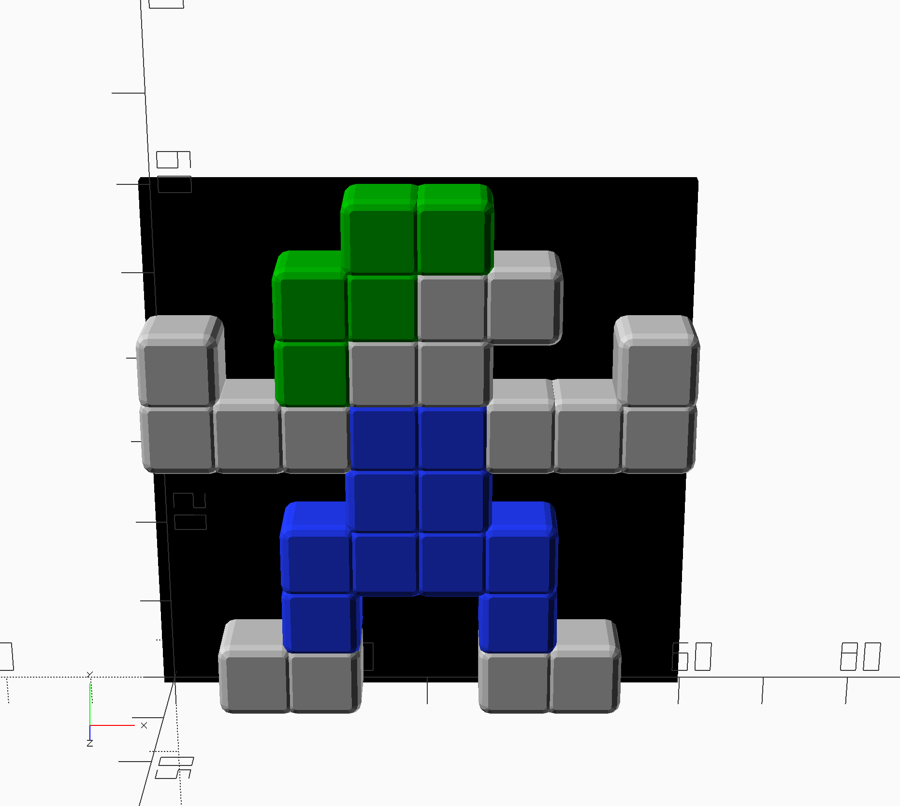
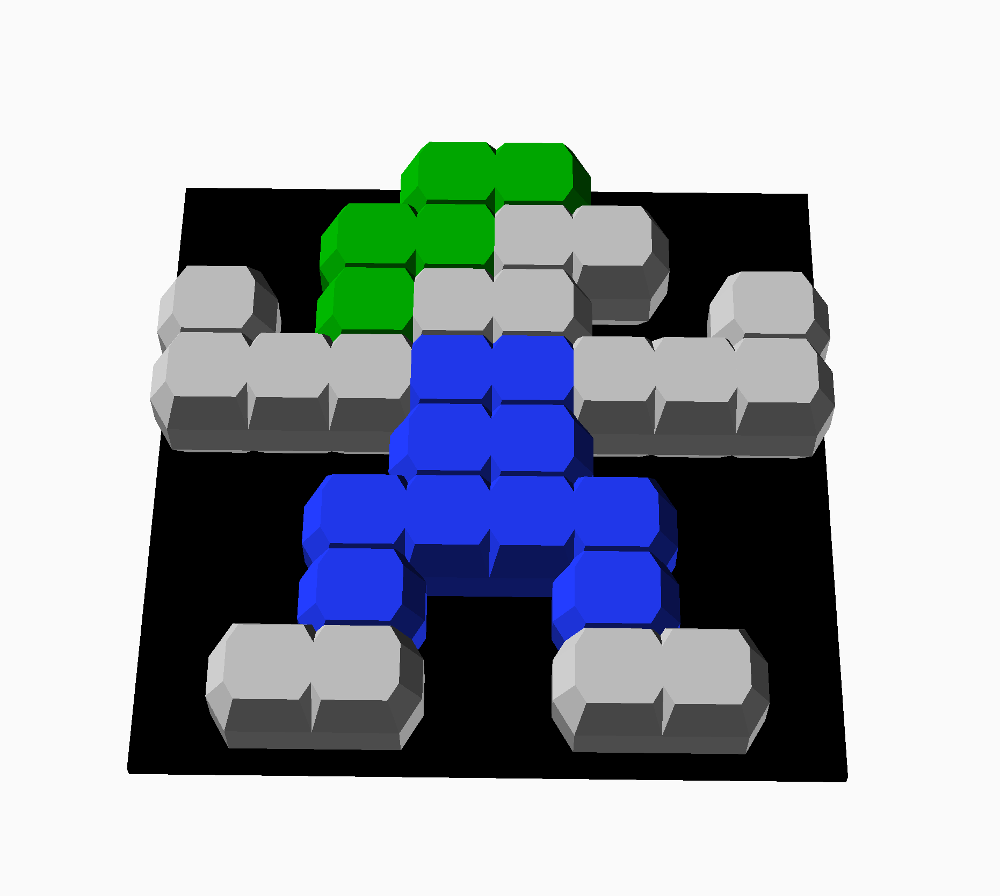
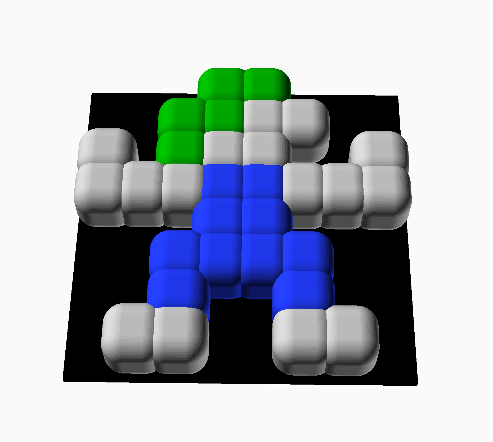
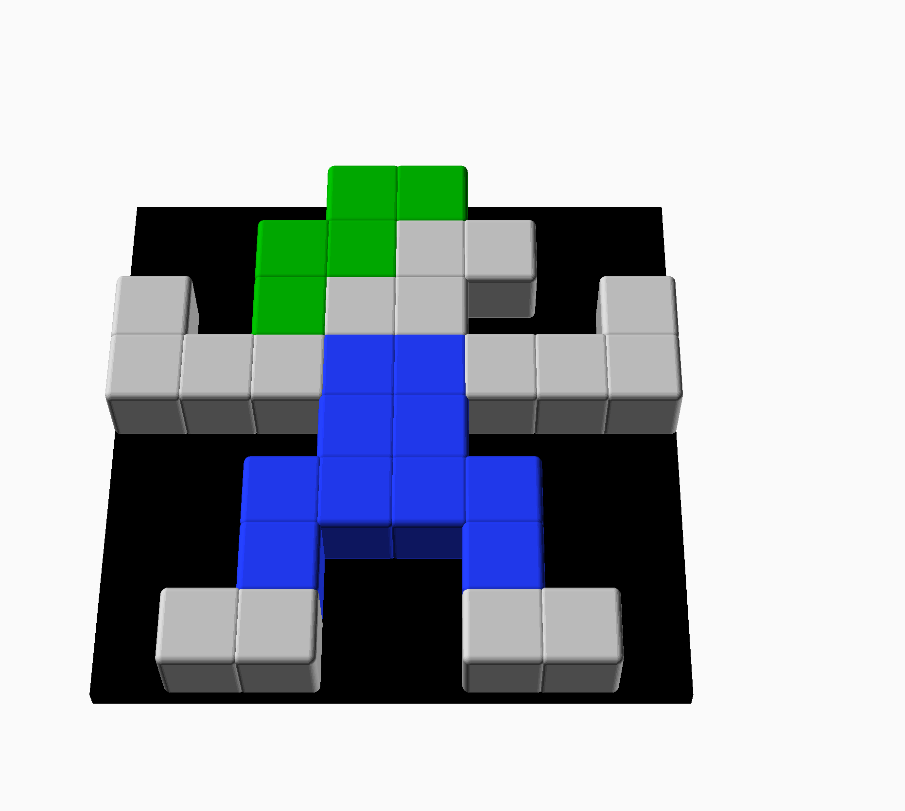
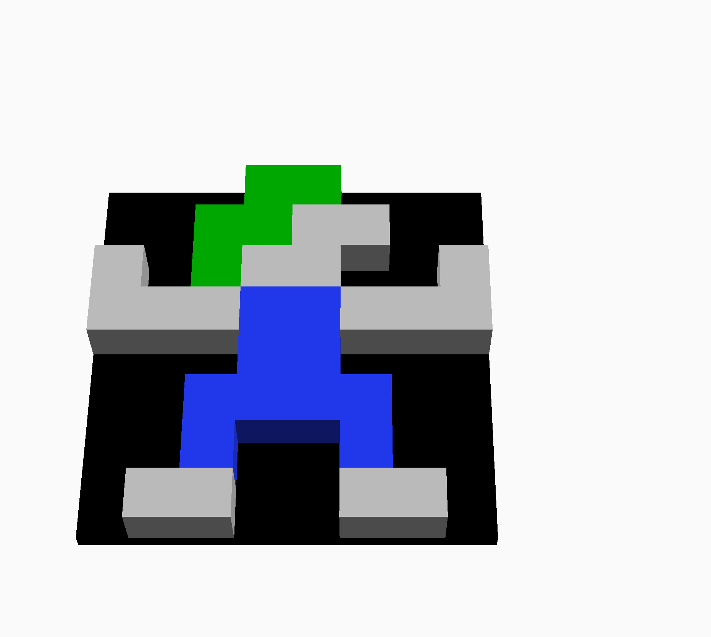
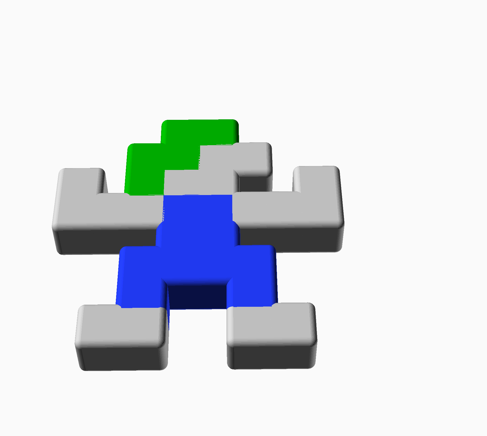
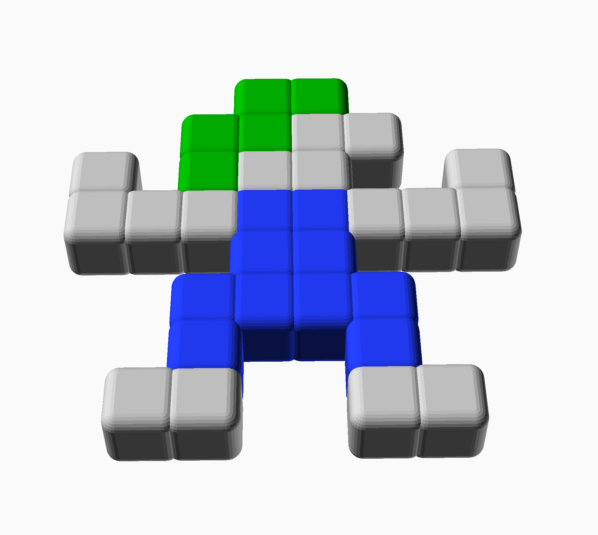
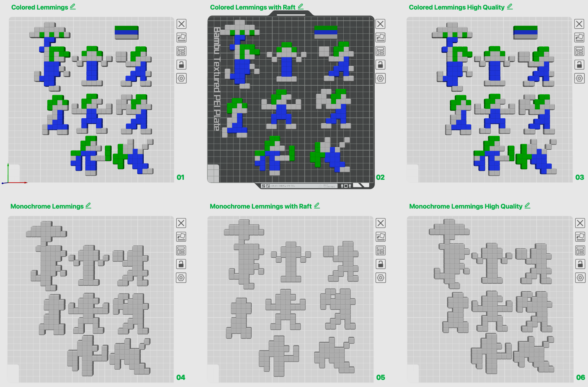

# More Lemmings

by IOIO72 aka Tamio Patrick Honma (https://honma.de)

This work is licensed under the Creative Commons Attribution-NonCommercial-ShareAlike 4.0 International License. To view a copy of this license, visit http://creativecommons.org/licenses/by-nc-sa/4.0/ or send a letter to Creative Commons, PO Box 1866, Mountain View, CA 94042, USA.

## Description

We all love the game series Lemmings. So here they are ready to conquer your territory, well, if they survive.

This package includes

* a **Lemmings customizer** (Lemmings.scad) to select a  Lemming and change its sizes and bevels according to your personal preferences.
  

  

  

  

  

  

  

* a **Lemmings.3mf** with **colored and monochrome** Lemmings and different print parameters to solve adhesion and quality issues.
  

* **3MF** and **STL** files for **each Lemming**.

## Printing

The adhesion to the plate may be too low for the pixel design. Therefore, either try to apply an additive to the plate or use a raft. If you want a higher quality, then you can iron the surfaces with the slicer.

The Lemmings.3mf file provides you with prepared plates for the cases described above.

## Why "more" Lemmings?

I have updated this pack to provide double the amount of Lemmings than before. In addition, I offer print-ready colour 3MF files that you can use with colour 3D printers, e.g. with an AMS.

**New characters:**

- Builder
- Miner
- Basher
- Floater (first double height character)

 

**Original set:**

- Walker
- Blocker
- Shrug
- Climber

 
